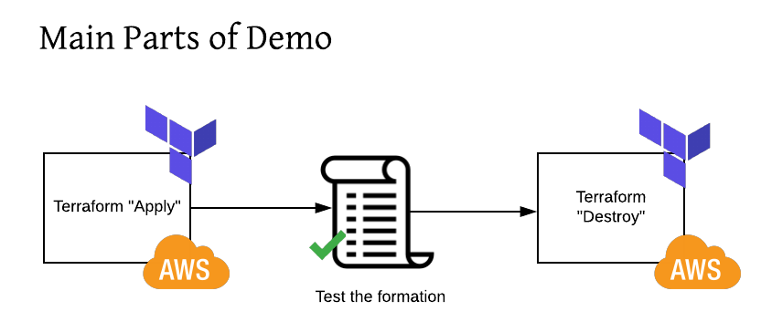
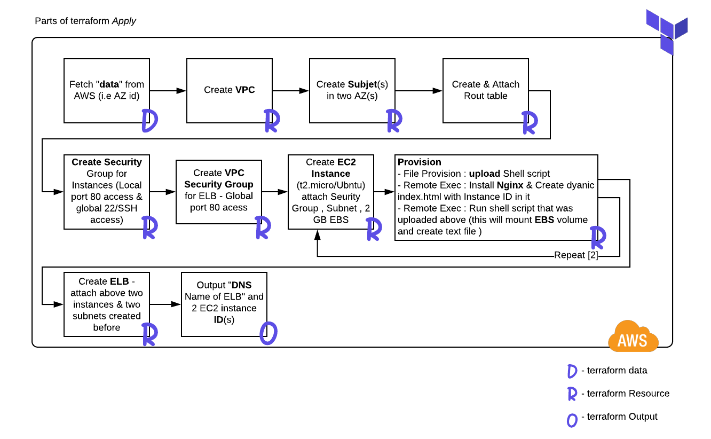

# aws-ec2-terraform

# Introduction 

  **Terraform provider for this sample is AWS**
  
  In this repo - we have a sample terraform project that does this :
  
  -   Query AWS for available Availability zones IDs & Subnet IDs in given VPC
  -   Create a new VPC 
  -   Create two Subnet in above VPC , attaching Route table  
  -   Create Security Group for VPC ( allow PORT 22 from everywhere & 80 only from local traffic )
  -   Create Security Group for Elastic Load balancer - only allow Port 80 from everywhere 
  -   Create ELB - attach two Subject from above VPC and attach EC2 instances that we are going to create bellow 
  -   Create two EC2 instance (Ubntu 16 - t2.micro ) 
        - Attach VPC Security Group
        - Attach One of the Subnet of above VPC 
        - Attach 2 GB EBS volume 
        - Attach user key to login via SSH in future 
        - Run 3 provisioner 
          - File - upload Shell script to EC2 instance ; that will mount above 2 EBS volume in machine 
          - remote-exe - install nginx web server , create a index.html on the fly (using Instance ID in HTML body )
          - remote-exe - run above Shell script that does volume mounting . Script will also create a sample file and write to newly mounted disk
  -   Once two E2 instance has been created - run bash script that will make sure ELB is running and two EC2 instances are accesable and were created  
      via this terraform script 
      
# Demo layout 

  As you can see this demo is mainly layed out in 3 major parts :
  
  -   Crate (terraform apply) - ec2withEBS_ELB.tf
-   Test (via Shell script) - runTest.sh
-   Destroy (terraform destroy)- ec2withEBS_ELB.tf       



# Final destination 

 With this demo this is what we are aiming to get to on AWS
 
  

# Terraform - Detail plan about how to get to destination  

  Details about how we are planing to build all needed AWS Resources to get to above destination
  
   

# Demo in action 

  Below video (gif) shows some parts of demo in action 
  
  
  
# Complete output

<details>
  <summary>Click to see full output</summary>

```bash
(venv) ➜  w10 git:(master) ✗ /bin/zsh runTest.sh 
############## About to run terraform destroy #######################
data.aws_availability_zones.available: Refreshing state...

Destroy complete! Resources: 0 destroyed.
############## About to run terraform apply #######################
data.aws_availability_zones.available: Refreshing state...
aws_vpc.w10_terraform: Creating...
aws_vpc.w10_terraform: Creation complete after 3s [id=vpc-0330985612594dc98]
aws_internet_gateway.default: Creating...
aws_subnet.subnet2: Creating...
aws_subnet.subnet1: Creating...
aws_security_group.elb-sg: Creating...
aws_security_group.nginx-sg: Creating...
aws_subnet.subnet2: Creation complete after 1s [id=subnet-0e37f9f342bead966]
aws_subnet.subnet1: Creation complete after 1s [id=subnet-00e61b98f98bf1c56]
data.aws_subnet_ids.sub_ids: Refreshing state...
aws_internet_gateway.default: Creation complete after 1s [id=igw-00aa54a88be7aad91]
aws_route_table.rtb: Creating...
aws_route_table.rtb: Creation complete after 1s [id=rtb-0b187ed721083b2c1]
aws_route_table_association.rta-subnet1: Creating...
aws_route_table_association.rta-subnet2: Creating...
aws_route_table_association.rta-subnet1: Creation complete after 0s [id=rtbassoc-0ff6e3945d4c5b783]
aws_route_table_association.rta-subnet2: Creation complete after 0s [id=rtbassoc-029d247cdd05efb8f]
aws_security_group.elb-sg: Creation complete after 3s [id=sg-0df14d0ef29b36415]
aws_security_group.nginx-sg: Creation complete after 3s [id=sg-0debc801f09b6df13]
aws_instance.nginx[0]: Creating...
aws_instance.nginx[1]: Creating...
aws_instance.nginx[0]: Still creating... [10s elapsed]
aws_instance.nginx[1]: Still creating... [10s elapsed]
aws_instance.nginx[1]: Still creating... [20s elapsed]
aws_instance.nginx[0]: Still creating... [20s elapsed]
aws_instance.nginx[1]: Still creating... [30s elapsed]
aws_instance.nginx[0]: Still creating... [30s elapsed]
aws_instance.nginx[0]: Provisioning with 'file'...
aws_instance.nginx[1]: Provisioning with 'file'...
aws_instance.nginx[1]: Still creating... [40s elapsed]
aws_instance.nginx[0]: Still creating... [40s elapsed]
aws_instance.nginx[1]: Provisioning with 'remote-exec'...
aws_instance.nginx[1] (remote-exec): Connecting to remote host via SSH...
aws_instance.nginx[1] (remote-exec):   Host: ec2-54-188-250-250.us-west-2.compute.amazonaws.com
aws_instance.nginx[1] (remote-exec):   User: ubuntu
aws_instance.nginx[1] (remote-exec):   Password: false
aws_instance.nginx[1] (remote-exec):   Private key: true
aws_instance.nginx[1] (remote-exec):   Certificate: false
aws_instance.nginx[1] (remote-exec):   SSH Agent: false
aws_instance.nginx[1] (remote-exec):   Checking Host Key: false
aws_instance.nginx[1] (remote-exec): Connected!
aws_instance.nginx[0]: Provisioning with 'remote-exec'...
aws_instance.nginx[0] (remote-exec): Connecting to remote host via SSH...
aws_instance.nginx[0] (remote-exec):   Host: ec2-34-216-223-51.us-west-2.compute.amazonaws.com
aws_instance.nginx[0] (remote-exec):   User: ubuntu
aws_instance.nginx[0] (remote-exec):   Password: false
aws_instance.nginx[0] (remote-exec):   Private key: true
aws_instance.nginx[0] (remote-exec):   Certificate: false
aws_instance.nginx[0] (remote-exec):   SSH Agent: false
aws_instance.nginx[0] (remote-exec):   Checking Host Key: false
aws_instance.nginx[1] (remote-exec): sudo: unable to resolve host ip-10-1-1-20
aws_instance.nginx[1] (remote-exec): 0% [Working]
aws_instance.nginx[0] (remote-exec): Connected!
aws_instance.nginx[1] (remote-exec): Get:1 http://security.ubuntu.com/ubuntu xenial-security InRelease [109 kB]
aws_instance.nginx[1] (remote-exec): 0% [Connecting to archive.ubuntu.com (9
aws_instance.nginx[1] (remote-exec): Hit:2 http://archive.ubuntu.com/ubuntu xenial InRelease
aws_instance.nginx[1] (remote-exec): 0% [Connecting to archive.ubuntu.com (9
aws_instance.nginx[1] (remote-exec): 0% [Connecting to archive.ubuntu.com (9
aws_instance.nginx[1] (remote-exec): 0% [2 InRelease gpgv 247 kB] [Connectin
aws_instance.nginx[1] (remote-exec): 0% [Connecting to archive.ubuntu.com (9
aws_instance.nginx[1] (remote-exec): 0% [1 InRelease gpgv 109 kB] [Connectin
aws_instance.nginx[1] (remote-exec): 0% [Waiting for headers]
aws_instance.nginx[1] (remote-exec): Get:3 http://archive.ubuntu.com/ubuntu xenial-updates InRelease [109 kB]
aws_instance.nginx[1] (remote-exec): 0% [3 InRelease 14.2 kB/109 kB 13%] [Wa
aws_instance.nginx[1] (remote-exec): Get:4 http://security.ubuntu.com/ubuntu xenial-security/main amd64 Packages [739 kB]
aws_instance.nginx[1] (remote-exec): 0% [3 InRelease 14.2 kB/109 kB 13%] [4
aws_instance.nginx[0] (remote-exec): 0% [Working]
aws_instance.nginx[0] (remote-exec): Get:1 http://security.ubuntu.com/ubuntu xenial-security InRelease [109 kB]
aws_instance.nginx[1] (remote-exec): 0% [Connecting to archive.ubuntu.com (9
aws_instance.nginx[1] (remote-exec): 0% [3 InRelease gpgv 109 kB] [Connectin
aws_instance.nginx[1] (remote-exec): 0% [Connecting to archive.ubuntu.com (9
aws_instance.nginx[1] (remote-exec): 0% [Waiting for headers]
aws_instance.nginx[1] (remote-exec): 0% [4 Packages store 0 B] [Waiting for
aws_instance.nginx[1] (remote-exec): Get:5 http://archive.ubuntu.com/ubuntu xenial-backports InRelease [107 kB]
aws_instance.nginx[1] (remote-exec): Get:6 http://security.ubuntu.com/ubuntu xenial-security/main Translation-en [289 kB]
aws_instance.nginx[0] (remote-exec): 0% [Connecting to archive.ubuntu.com (9
aws_instance.nginx[0] (remote-exec): Hit:2 http://archive.ubuntu.com/ubuntu xenial InRelease
aws_instance.nginx[1] (remote-exec): 0% [4 Packages store 0 B] [5 InRelease
aws_instance.nginx[1] (remote-exec): 0% [5 InRelease 14.2 kB/107 kB 13%] [6
aws_instance.nginx[0] (remote-exec): 0% [1 InRelease 43.1 kB/109 kB 39%]
aws_instance.nginx[0] (remote-exec): 0% [2 InRelease gpgv 247 kB] [Connectin
aws_instance.nginx[0] (remote-exec): 0% [Waiting for headers] [1 InRelease 6
aws_instance.nginx[0] (remote-exec): 0% [Waiting for headers]
aws_instance.nginx[0] (remote-exec): 0% [1 InRelease gpgv 109 kB] [Waiting f
aws_instance.nginx[0] (remote-exec): Get:3 http://archive.ubuntu.com/ubuntu xenial-updates InRelease [109 kB]
aws_instance.nginx[1] (remote-exec): 0% [5 InRelease 101 kB/107 kB 95%]
aws_instance.nginx[1] (remote-exec): 0% [6 Translation-en store 0 B] [5 InRe
aws_instance.nginx[1] (remote-exec): 0% [6 Translation-en store 0 B] [Connec
aws_instance.nginx[1] (remote-exec): 0% [6 Translation-en store 0 B] [5 InRe
aws_instance.nginx[1] (remote-exec): 0% [5 InRelease gpgv 107 kB] [Connectin
aws_instance.nginx[1] (remote-exec): 20% [Connecting to archive.ubuntu.com (
aws_instance.nginx[1] (remote-exec): Get:7 http://security.ubuntu.com/ubuntu xenial-security/universe amd64 Packages [457 kB]
aws_instance.nginx[0] (remote-exec): 0% [1 InRelease gpgv 109 kB] [3 InRelea
aws_instance.nginx[0] (remote-exec): 0% [3 InRelease 14.2 kB/109 kB 13%]
aws_instance.nginx[1] (remote-exec): 20% [Connecting to archive.ubuntu.com (
aws_instance.nginx[1] (remote-exec): Get:8 http://archive.ubuntu.com/ubuntu xenial/universe amd64 Packages [7532 kB]
aws_instance.nginx[0] (remote-exec): Get:4 http://security.ubuntu.com/ubuntu xenial-security/main amd64 Packages [739 kB]
aws_instance.nginx[1] (remote-exec): 20% [8 Packages 14.2 kB/7532 kB 0%] [7
aws_instance.nginx[0] (remote-exec): 0% [3 InRelease 102 kB/109 kB 94%] [4 P
aws_instance.nginx[0] (remote-exec): 0% [Connecting to archive.ubuntu.com (9
aws_instance.nginx[0] (remote-exec): 0% [3 InRelease gpgv 109 kB] [Connectin
aws_instance.nginx[0] (remote-exec): 0% [Connecting to archive.ubuntu.com (9
aws_instance.nginx[0] (remote-exec): Get:5 http://archive.ubuntu.com/ubuntu xenial-backports InRelease [107 kB]
aws_instance.nginx[1] (remote-exec): 22% [8 Packages 101 kB/7532 kB 1%]
aws_instance.nginx[1] (remote-exec): 22% [7 Packages store 0 B] [8 Packages
aws_instance.nginx[0] (remote-exec): 0% [5 InRelease 2582 B/107 kB 2%] [4 Pa
aws_instance.nginx[1] (remote-exec): 23% [8 Packages 156 kB/7532 kB 2%] [Wai
aws_instance.nginx[1] (remote-exec): Get:9 http://security.ubuntu.com/ubuntu xenial-security/universe Translation-en [187 kB]
aws_instance.nginx[1] (remote-exec): 23% [8 Packages 231 kB/7532 kB 3%] [9 T
aws_instance.nginx[0] (remote-exec): 0% [Connecting to archive.ubuntu.com (9
aws_instance.nginx[0] (remote-exec): 0% [5 InRelease gpgv 107 kB] [Connectin
aws_instance.nginx[1] (remote-exec): 29% [8 Packages 1202 kB/7532 kB 16%] [C
aws_instance.nginx[1] (remote-exec): 29% [9 Translation-en store 0 B] [8 Pac
aws_instance.nginx[1] (remote-exec): 33% [8 Packages 1973 kB/7532 kB 26%] [W
aws_instance.nginx[1] (remote-exec): Get:10 http://security.ubuntu.com/ubuntu xenial-security/multiverse amd64 Packages [5596 B]
aws_instance.nginx[0] (remote-exec): 17% [Connecting to archive.ubuntu.com (
aws_instance.nginx[0] (remote-exec): 17% [Waiting for headers]
aws_instance.nginx[0] (remote-exec): 17% [4 Packages store 0 B] [Waiting for
aws_instance.nginx[0] (remote-exec): Get:6 http://archive.ubuntu.com/ubuntu xenial/universe amd64 Packages [7532 kB]
aws_instance.nginx[1] (remote-exec): 36% [8 Packages 2635 kB/7532 kB 35%] [C
aws_instance.nginx[1] (remote-exec): 36% [10 Packages store 0 B] [8 Packages
aws_instance.nginx[1] (remote-exec): 36% [8 Packages 2635 kB/7532 kB 35%] [C
aws_instance.nginx[0] (remote-exec): 17% [4 Packages store 0 B] [6 Packages
aws_instance.nginx[1] (remote-exec): Get:11 http://security.ubuntu.com/ubuntu xenial-security/multiverse Translation-en [2676 B]
aws_instance.nginx[0] (remote-exec): 18% [6 Packages 21.5 kB/7532 kB 0%] [Wa
aws_instance.nginx[0] (remote-exec): Get:7 http://security.ubuntu.com/ubuntu xenial-security/main Translation-en [289 kB]
aws_instance.nginx[1] (remote-exec): 47% [8 Packages 4753 kB/7532 kB 63%] [1
aws_instance.nginx[1] (remote-exec): 47% [8 Packages 4753 kB/7532 kB 63%]
aws_instance.nginx[1] (remote-exec): 47% [8 Packages 4753 kB/7532 kB 63%]
aws_instance.nginx[0] (remote-exec): 18% [6 Packages 28.7 kB/7532 kB 0%] [7
aws_instance.nginx[1] (remote-exec): 60% [Working]
aws_instance.nginx[1] (remote-exec): 60% [8 Packages store 0 B]
aws_instance.nginx[1] (remote-exec): Get:12 http://archive.ubuntu.com/ubuntu xenial/universe Translation-en [4354 kB]
aws_instance.nginx[0] (remote-exec): 20% [6 Packages 385 kB/7532 kB 5%] [7 T
aws_instance.nginx[1] (remote-exec): 60% [8 Packages store 0 B] [12 Translat
aws_instance.nginx[0] (remote-exec): 24% [6 Packages 997 kB/7532 kB 13%] [Co
aws_instance.nginx[0] (remote-exec): 24% [7 Translation-en store 0 B] [6 Pac
aws_instance.nginx[0] (remote-exec): Get:8 http://security.ubuntu.com/ubuntu xenial-security/universe amd64 Packages [457 kB]
aws_instance.nginx[0] (remote-exec): 36% [7 Translation-en store 0 B] [6 Pac
aws_instance.nginx[0] (remote-exec): 37% [6 Packages 3595 kB/7532 kB 48%] [8
aws_instance.nginx[1] (remote-exec): 61% [8 Packages store 0 B] [12 Translat
aws_instance.nginx[0] (remote-exec): 56% [8 Packages 88.1 kB/457 kB 19%]
aws_instance.nginx[0] (remote-exec): 56% [6 Packages store 0 B] [8 Packages
aws_instance.nginx[0] (remote-exec): Get:9 http://archive.ubuntu.com/ubuntu xenial/universe Translation-en [4354 kB]
aws_instance.nginx[1] (remote-exec): 66% [8 Packages store 0 B] [12 Translat
aws_instance.nginx[0] (remote-exec): 57% [6 Packages store 0 B] [9 Translati
aws_instance.nginx[0] (remote-exec): 58% [6 Packages store 0 B] [9 Translati
aws_instance.nginx[0] (remote-exec): Get:10 http://security.ubuntu.com/ubuntu xenial-security/universe Translation-en [187 kB]
aws_instance.nginx[0] (remote-exec): 58% [6 Packages store 0 B] [9 Translati
aws_instance.nginx[1] (remote-exec): 81% [8 Packages store 0 B] [12 Translat
aws_instance.nginx[1] (remote-exec): 81% [8 Packages store 0 B]
aws_instance.nginx[1] (remote-exec): Get:13 http://archive.ubuntu.com/ubuntu xenial/multiverse amd64 Packages [144 kB]
aws_instance.nginx[1] (remote-exec): 81% [8 Packages store 0 B] [13 Packages
aws_instance.nginx[0] (remote-exec): 63% [6 Packages store 0 B] [9 Translati
aws_instance.nginx[0] (remote-exec): 67% [6 Packages store 0 B] [9 Translati
aws_instance.nginx[0] (remote-exec): 80% [6 Packages store 0 B] [Waiting for
aws_instance.nginx[0] (remote-exec): Get:11 http://security.ubuntu.com/ubuntu xenial-security/multiverse amd64 Packages [5596 B]
aws_instance.nginx[0] (remote-exec): 80% [6 Packages store 0 B] [Connecting
aws_instance.nginx[1] (remote-exec): 82% [13 Packages 120 kB/144 kB 83%]
aws_instance.nginx[1] (remote-exec): 82% [12 Translation-en store 0 B] [13 P
aws_instance.nginx[1] (remote-exec): 82% [12 Translation-en store 0 B] [Conn
aws_instance.nginx[0] (remote-exec): Get:12 http://archive.ubuntu.com/ubuntu xenial/multiverse amd64 Packages [144 kB]
aws_instance.nginx[0] (remote-exec): 80% [6 Packages store 0 B] [12 Packages
aws_instance.nginx[0] (remote-exec): Get:13 http://security.ubuntu.com/ubuntu xenial-security/multiverse Translation-en [2676 B]
aws_instance.nginx[1] (remote-exec): Get:14 http://archive.ubuntu.com/ubuntu xenial/multiverse Translation-en [106 kB]
aws_instance.nginx[0] (remote-exec): 80% [6 Packages store 0 B] [12 Packages
aws_instance.nginx[1] (remote-exec): 82% [12 Translation-en store 0 B] [14 T
aws_instance.nginx[1] (remote-exec): 83% [12 Translation-en store 0 B] [Conn
aws_instance.nginx[1] (remote-exec): Get:15 http://archive.ubuntu.com/ubuntu xenial-updates/main amd64 Packages [1033 kB]
aws_instance.nginx[0] (remote-exec): 80% [6 Packages store 0 B] [Connecting
aws_instance.nginx[0] (remote-exec): 81% [Connecting to archive.ubuntu.com (
aws_instance.nginx[0] (remote-exec): 81% [8 Packages store 0 B] [Connecting
aws_instance.nginx[0] (remote-exec): 81% [Connecting to archive.ubuntu.com (
aws_instance.nginx[0] (remote-exec): 81% [10 Translation-en store 0 B] [Conn
aws_instance.nginx[0] (remote-exec): 81% [Waiting for headers]  2300 kB/s 1s
aws_instance.nginx[0] (remote-exec): 81% [9 Translation-en store 0 B] [Waiti
aws_instance.nginx[0] (remote-exec): Get:14 http://archive.ubuntu.com/ubuntu xenial/multiverse Translation-en [106 kB]
aws_instance.nginx[1] (remote-exec): 83% [12 Translation-en store 0 B] [15 P
aws_instance.nginx[0] (remote-exec): 81% [9 Translation-en store 0 B] [14 Tr
aws_instance.nginx[1] (remote-exec): 83% [15 Packages 37.4 kB/1033 kB 4%]
aws_instance.nginx[1] (remote-exec): 83% [13 Packages store 0 B] [15 Package
aws_instance.nginx[1] (remote-exec): 84% [15 Packages 43.2 kB/1033 kB 4%]
aws_instance.nginx[1] (remote-exec): 84% [14 Translation-en store 0 B] [15 P
aws_instance.nginx[1] (remote-exec): 84% [15 Packages 43.2 kB/1033 kB 4%]
aws_instance.nginx[0] (remote-exec): 82% [9 Translation-en store 0 B] [Conne
aws_instance.nginx[0] (remote-exec): Get:15 http://archive.ubuntu.com/ubuntu xenial-updates/main amd64 Packages [1033 kB]
aws_instance.nginx[1] (remote-exec): 86% [15 Packages 441 kB/1033 kB 43%]
aws_instance.nginx[0] (remote-exec): 82% [9 Translation-en store 0 B] [15 Pa
aws_instance.nginx[1] (remote-exec): 89% [Working]              2287 kB/s 0s
aws_instance.nginx[1] (remote-exec): 89% [15 Packages store 0 B]
aws_instance.nginx[0]: Still creating... [50s elapsed]
aws_instance.nginx[1]: Still creating... [50s elapsed]
aws_instance.nginx[1] (remote-exec): Get:16 http://archive.ubuntu.com/ubuntu xenial-updates/main Translation-en [402 kB]
aws_instance.nginx[1] (remote-exec): 89% [15 Packages store 0 B] [16 Transla
aws_instance.nginx[1] (remote-exec): 89% [16 Translation-en 14.3 kB/402 kB 4
aws_instance.nginx[0] (remote-exec): 83% [9 Translation-en store 0 B] [15 Pa
aws_instance.nginx[0] (remote-exec): 83% [15 Packages 159 kB/1033 kB 15%]
aws_instance.nginx[0] (remote-exec): 83% [11 Packages store 0 B] [15 Package
aws_instance.nginx[0] (remote-exec): 83% [15 Packages 159 kB/1033 kB 15%]
aws_instance.nginx[0] (remote-exec): 83% [13 Translation-en store 0 B] [15 P
aws_instance.nginx[0] (remote-exec): 84% [15 Packages 162 kB/1033 kB 16%]
aws_instance.nginx[0] (remote-exec): 84% [12 Packages store 0 B] [15 Package
aws_instance.nginx[0] (remote-exec): 84% [15 Packages 202 kB/1033 kB 20%]
aws_instance.nginx[0] (remote-exec): 84% [14 Translation-en store 0 B] [15 P
aws_instance.nginx[0] (remote-exec): 85% [15 Packages 234 kB/1033 kB 23%]
aws_instance.nginx[0] (remote-exec): 89% [Working]              2300 kB/s 0s
aws_instance.nginx[0] (remote-exec): 89% [15 Packages store 0 B]
aws_instance.nginx[1] (remote-exec): 90% [16 Translation-en 237 kB/402 kB 59
aws_instance.nginx[0] (remote-exec): Get:16 http://archive.ubuntu.com/ubuntu xenial-updates/main Translation-en [402 kB]
aws_instance.nginx[1] (remote-exec): 91% [Working]              2287 kB/s 0s
aws_instance.nginx[1] (remote-exec): 91% [16 Translation-en store 0 B]
aws_instance.nginx[0] (remote-exec): 89% [15 Packages store 0 B] [16 Transla
aws_instance.nginx[0] (remote-exec): 89% [16 Translation-en 14.3 kB/402 kB 4
aws_instance.nginx[1] (remote-exec): 91% [Waiting for headers]  2287 kB/s 0s
aws_instance.nginx[1] (remote-exec): Get:17 http://archive.ubuntu.com/ubuntu xenial-updates/universe amd64 Packages [764 kB]
aws_instance.nginx[1] (remote-exec): 92% [17 Packages 14.3 kB/764 kB 2%]
aws_instance.nginx[0] (remote-exec): 90% [16 Translation-en 226 kB/402 kB 56
aws_instance.nginx[0] (remote-exec): 91% [Working]              2300 kB/s 0s
aws_instance.nginx[0] (remote-exec): 91% [16 Translation-en store 0 B]
aws_instance.nginx[1] (remote-exec): 92% [17 Packages 124 kB/764 kB 16%]
aws_instance.nginx[0] (remote-exec): 91% [Waiting for headers]  2300 kB/s 0s
aws_instance.nginx[0] (remote-exec): Get:17 http://archive.ubuntu.com/ubuntu xenial-updates/universe amd64 Packages [764 kB]
aws_instance.nginx[0] (remote-exec): 92% [17 Packages 2668 B/764 kB 0%]
aws_instance.nginx[1] (remote-exec): 95% [Working]              2287 kB/s 0s
aws_instance.nginx[1] (remote-exec): 95% [17 Packages store 0 B]
aws_instance.nginx[1] (remote-exec): 96% [Waiting for headers]  2287 kB/s 0s
aws_instance.nginx[1] (remote-exec): Get:18 http://archive.ubuntu.com/ubuntu xenial-updates/universe Translation-en [320 kB]
aws_instance.nginx[1] (remote-exec): 96% [18 Translation-en 0 B/320 kB 0%]
aws_instance.nginx[0] (remote-exec): 92% [17 Packages 119 kB/764 kB 16%]
aws_instance.nginx[0] (remote-exec): 95% [Working]              2300 kB/s 0s
aws_instance.nginx[0] (remote-exec): 95% [17 Packages store 0 B]
aws_instance.nginx[1] (remote-exec): 96% [18 Translation-en 123 kB/320 kB 38
aws_instance.nginx[0] (remote-exec): 96% [Waiting for headers]  2300 kB/s 0s
aws_instance.nginx[0] (remote-exec): Get:18 http://archive.ubuntu.com/ubuntu xenial-updates/universe Translation-en [320 kB]
aws_instance.nginx[1] (remote-exec): 97% [Working]              2287 kB/s 0s
aws_instance.nginx[1] (remote-exec): 97% [18 Translation-en store 0 B]
aws_instance.nginx[0] (remote-exec): 96% [18 Translation-en 2668 B/320 kB 1%
aws_instance.nginx[1] (remote-exec): 97% [Connecting to archive.ubuntu.com (
aws_instance.nginx[1] (remote-exec): Get:19 http://archive.ubuntu.com/ubuntu xenial-updates/multiverse amd64 Packages [16.7 kB]
aws_instance.nginx[1] (remote-exec): 98% [19 Packages 14.3 kB/16.7 kB 86%]
aws_instance.nginx[1] (remote-exec): 98% [Connecting to archive.ubuntu.com (
aws_instance.nginx[1] (remote-exec): 98% [19 Packages store 0 B] [Connecting
aws_instance.nginx[1] (remote-exec): 98% [Connecting to archive.ubuntu.com (
aws_instance.nginx[0] (remote-exec): 96% [18 Translation-en 124 kB/320 kB 39
aws_instance.nginx[1] (remote-exec): Get:20 http://archive.ubuntu.com/ubuntu xenial-updates/multiverse Translation-en [8440 B]
aws_instance.nginx[1] (remote-exec): 98% [Connecting to archive.ubuntu.com (
aws_instance.nginx[1] (remote-exec): 98% [20 Translation-en store 0 B] [Conn
aws_instance.nginx[1] (remote-exec): 98% [Connecting to archive.ubuntu.com (
aws_instance.nginx[0] (remote-exec): 97% [Working]              2300 kB/s 0s
aws_instance.nginx[0] (remote-exec): 97% [18 Translation-en store 0 B]
aws_instance.nginx[0] (remote-exec): 97% [Connecting to archive.ubuntu.com (
aws_instance.nginx[1] (remote-exec): Get:21 http://archive.ubuntu.com/ubuntu xenial-backports/main amd64 Packages [7280 B]
aws_instance.nginx[0] (remote-exec): Get:19 http://archive.ubuntu.com/ubuntu xenial-updates/multiverse amd64 Packages [16.7 kB]
aws_instance.nginx[1] (remote-exec): 98% [21 Packages 0 B/7280 B 0%]
aws_instance.nginx[1] (remote-exec): 98% [Working]               455 kB/s 0s
aws_instance.nginx[1] (remote-exec): 98% [21 Packages store 0 B] [Connecting
aws_instance.nginx[1] (remote-exec): 99% [Connecting to archive.ubuntu.com (
aws_instance.nginx[0] (remote-exec): 97% [19 Packages 2670 B/16.7 kB 16%]
aws_instance.nginx[0] (remote-exec): 98% [Connecting to archive.ubuntu.com (
aws_instance.nginx[0] (remote-exec): 98% [19 Packages store 0 B] [Connecting
aws_instance.nginx[0] (remote-exec): 98% [Connecting to archive.ubuntu.com (
aws_instance.nginx[1] (remote-exec): Get:22 http://archive.ubuntu.com/ubuntu xenial-backports/main Translation-en [4456 B]
aws_instance.nginx[1] (remote-exec): 99% [22 Translation-en 0 B/4456 B 0%]
aws_instance.nginx[1] (remote-exec): 99% [Working]               455 kB/s 0s
aws_instance.nginx[1] (remote-exec): 99% [22 Translation-en store 0 B] [Conn
aws_instance.nginx[1] (remote-exec): 99% [Connecting to archive.ubuntu.com (
aws_instance.nginx[0] (remote-exec): Get:20 http://archive.ubuntu.com/ubuntu xenial-updates/multiverse Translation-en [8440 B]
aws_instance.nginx[0] (remote-exec): 98% [20 Translation-en 2671 B/8440 B 32
aws_instance.nginx[0] (remote-exec): 98% [Connecting to archive.ubuntu.com (
aws_instance.nginx[0] (remote-exec): 98% [20 Translation-en store 0 B] [Conn
aws_instance.nginx[0] (remote-exec): 98% [Connecting to archive.ubuntu.com (
aws_instance.nginx[1] (remote-exec): Get:23 http://archive.ubuntu.com/ubuntu xenial-backports/universe amd64 Packages [8064 B]
aws_instance.nginx[1] (remote-exec): 99% [23 Packages 0 B/8064 B 0%]
aws_instance.nginx[1] (remote-exec): 99% [Working]               455 kB/s 0s
aws_instance.nginx[1] (remote-exec): 99% [23 Packages store 0 B]
aws_instance.nginx[1] (remote-exec): 100% [Working]              455 kB/s 0s
aws_instance.nginx[0] (remote-exec): Get:21 http://archive.ubuntu.com/ubuntu xenial-backports/main amd64 Packages [7280 B]
aws_instance.nginx[1] (remote-exec): Get:24 http://archive.ubuntu.com/ubuntu xenial-backports/universe Translation-en [4328 B]
aws_instance.nginx[0] (remote-exec): 98% [21 Packages 2671 B/7280 B 37%]
aws_instance.nginx[0] (remote-exec): 98% [Connecting to archive.ubuntu.com (
aws_instance.nginx[0] (remote-exec): 98% [21 Packages store 0 B] [Connecting
aws_instance.nginx[0] (remote-exec): 99% [Connecting to archive.ubuntu.com (
aws_instance.nginx[1] (remote-exec): 100% [24 Translation-en 0 B/4328 B 0%]
aws_instance.nginx[1] (remote-exec): 100% [Working]              455 kB/s 0s
aws_instance.nginx[1] (remote-exec): 100% [24 Translation-en store 0 B]
aws_instance.nginx[1] (remote-exec): 100% [Working]              455 kB/s 0s
aws_instance.nginx[1] (remote-exec): Fetched 16.7 MB in 13s (1202 kB/s)
aws_instance.nginx[0] (remote-exec): Get:22 http://archive.ubuntu.com/ubuntu xenial-backports/main Translation-en [4456 B]
aws_instance.nginx[0] (remote-exec): 99% [22 Translation-en 2671 B/4456 B 60
aws_instance.nginx[0] (remote-exec): 99% [Connecting to archive.ubuntu.com (
aws_instance.nginx[0] (remote-exec): 99% [22 Translation-en store 0 B] [Conn
aws_instance.nginx[0] (remote-exec): 99% [Connecting to archive.ubuntu.com (
aws_instance.nginx[0] (remote-exec): Get:23 http://archive.ubuntu.com/ubuntu xenial-backports/universe amd64 Packages [8064 B]
aws_instance.nginx[0] (remote-exec): 99% [23 Packages 2671 B/8064 B 33%]
aws_instance.nginx[0] (remote-exec): 99% [Connecting to archive.ubuntu.com (
aws_instance.nginx[0] (remote-exec): 99% [23 Packages store 0 B] [Connecting
aws_instance.nginx[0] (remote-exec): 100% [Connecting to archive.ubuntu.com
aws_instance.nginx[0] (remote-exec): Get:24 http://archive.ubuntu.com/ubuntu xenial-backports/universe Translation-en [4328 B]
aws_instance.nginx[0] (remote-exec): 100% [24 Translation-en 2671 B/4328 B 6
aws_instance.nginx[0] (remote-exec): 100% [Working]              433 kB/s 0s
aws_instance.nginx[0] (remote-exec): 100% [24 Translation-en store 0 B]
aws_instance.nginx[0] (remote-exec): 100% [Working]              433 kB/s 0s
aws_instance.nginx[0] (remote-exec): Fetched 16.7 MB in 13s (1240 kB/s)
aws_instance.nginx[0] (remote-exec): Reading package lists... 0%
aws_instance.nginx[0] (remote-exec): Reading package lists... 0%
aws_instance.nginx[0] (remote-exec): Reading package lists... 1%
aws_instance.nginx[0] (remote-exec): Reading package lists... 40%
aws_instance.nginx[0] (remote-exec): Reading package lists... 40%
aws_instance.nginx[0] (remote-exec): Reading package lists... 62%
aws_instance.nginx[0] (remote-exec): Reading package lists... 62%
aws_instance.nginx[0] (remote-exec): Reading package lists... 63%
aws_instance.nginx[0] (remote-exec): Reading package lists... 63%
aws_instance.nginx[0] (remote-exec): Reading package lists... 64%
aws_instance.nginx[0] (remote-exec): Reading package lists... 64%
aws_instance.nginx[0] (remote-exec): Reading package lists... 70%
aws_instance.nginx[0] (remote-exec): Reading package lists... 70%
aws_instance.nginx[0] (remote-exec): Reading package lists... 77%
aws_instance.nginx[0] (remote-exec): Reading package lists... 77%
aws_instance.nginx[0] (remote-exec): Reading package lists... 78%
aws_instance.nginx[0] (remote-exec): Reading package lists... 81%
aws_instance.nginx[0] (remote-exec): Reading package lists... 81%
aws_instance.nginx[0] (remote-exec): Reading package lists... 84%
aws_instance.nginx[0] (remote-exec): Reading package lists... 84%
aws_instance.nginx[0] (remote-exec): Reading package lists... 84%
aws_instance.nginx[0] (remote-exec): Reading package lists... 84%
aws_instance.nginx[0] (remote-exec): Reading package lists... 84%
aws_instance.nginx[0] (remote-exec): Reading package lists... 84%
aws_instance.nginx[0] (remote-exec): Reading package lists... 84%
aws_instance.nginx[0] (remote-exec): Reading package lists... 84%
aws_instance.nginx[0] (remote-exec): Reading package lists... 84%
aws_instance.nginx[0] (remote-exec): Reading package lists... 84%
aws_instance.nginx[0] (remote-exec): Reading package lists... 84%
aws_instance.nginx[0] (remote-exec): Reading package lists... 84%
aws_instance.nginx[0] (remote-exec): Reading package lists... 84%
aws_instance.nginx[0] (remote-exec): Reading package lists... 84%
aws_instance.nginx[0] (remote-exec): Reading package lists... 89%
aws_instance.nginx[0] (remote-exec): Reading package lists... 89%
aws_instance.nginx[0] (remote-exec): Reading package lists... 94%
aws_instance.nginx[0] (remote-exec): Reading package lists... 94%
aws_instance.nginx[0] (remote-exec): Reading package lists... 94%
aws_instance.nginx[0] (remote-exec): Reading package lists... 94%
aws_instance.nginx[0] (remote-exec): Reading package lists... 94%
aws_instance.nginx[0] (remote-exec): Reading package lists... 94%
aws_instance.nginx[0] (remote-exec): Reading package lists... 97%
aws_instance.nginx[0] (remote-exec): Reading package lists... 97%
aws_instance.nginx[0] (remote-exec): Reading package lists... 99%
aws_instance.nginx[0] (remote-exec): Reading package lists... 99%
aws_instance.nginx[0] (remote-exec): Reading package lists... 99%
aws_instance.nginx[0] (remote-exec): Reading package lists... 99%
aws_instance.nginx[0] (remote-exec): Reading package lists... 99%
aws_instance.nginx[0] (remote-exec): Reading package lists... 99%
aws_instance.nginx[0] (remote-exec): Reading package lists... Done
aws_instance.nginx[0] (remote-exec): sudo: unable to resolve host ip-10-1-0-243
aws_instance.nginx[0] (remote-exec): Reading package lists... 0%
aws_instance.nginx[0] (remote-exec): Reading package lists... 0%
aws_instance.nginx[0] (remote-exec): Reading package lists... 1%
aws_instance.nginx[0] (remote-exec): Reading package lists... 32%
aws_instance.nginx[0] (remote-exec): Reading package lists... 32%
aws_instance.nginx[0] (remote-exec): Reading package lists... 65%
aws_instance.nginx[0] (remote-exec): Reading package lists... 65%
aws_instance.nginx[0] (remote-exec): Reading package lists... 65%
aws_instance.nginx[0] (remote-exec): Reading package lists... 65%
aws_instance.nginx[0] (remote-exec): Reading package lists... 65%
aws_instance.nginx[0] (remote-exec): Reading package lists... 65%
aws_instance.nginx[0] (remote-exec): Reading package lists... 85%
aws_instance.nginx[0] (remote-exec): Reading package lists... 85%
aws_instance.nginx[0] (remote-exec): Reading package lists... 96%
aws_instance.nginx[0] (remote-exec): Reading package lists... 96%
aws_instance.nginx[0] (remote-exec): Reading package lists... 97%
aws_instance.nginx[0] (remote-exec): Reading package lists... 97%
aws_instance.nginx[0] (remote-exec): Reading package lists... 97%
aws_instance.nginx[0] (remote-exec): Reading package lists... 97%
aws_instance.nginx[0] (remote-exec): Reading package lists... Done
aws_instance.nginx[0] (remote-exec): Building dependency tree... 0%
aws_instance.nginx[0] (remote-exec): Building dependency tree... 0%
aws_instance.nginx[0] (remote-exec): Building dependency tree... 50%
aws_instance.nginx[0] (remote-exec): Building dependency tree... 50%
aws_instance.nginx[0] (remote-exec): Building dependency tree
aws_instance.nginx[0] (remote-exec): Reading state information... 0%
aws_instance.nginx[0] (remote-exec): Reading state information... 5%
aws_instance.nginx[0] (remote-exec): Reading state information... Done
aws_instance.nginx[0] (remote-exec): The following additional packages will be installed:
aws_instance.nginx[0] (remote-exec):   nginx-common nginx-light
aws_instance.nginx[0] (remote-exec): Suggested packages:
aws_instance.nginx[0] (remote-exec):   fcgiwrap nginx-doc ssl-cert
aws_instance.nginx[0] (remote-exec): The following NEW packages will be installed:
aws_instance.nginx[0] (remote-exec):   nginx nginx-common nginx-light
aws_instance.nginx[0] (remote-exec): 0 upgraded, 3 newly installed, 0 to remove and 25 not upgraded.
aws_instance.nginx[0] (remote-exec): Need to get 346 kB of archives.
aws_instance.nginx[0] (remote-exec): After this operation, 1,098 kB of additional disk space will be used.
aws_instance.nginx[0] (remote-exec): 0% [Working]
aws_instance.nginx[0] (remote-exec): Get:1 http://security.ubuntu.com/ubuntu xenial-security/main amd64 nginx-common all 1.10.3-0ubuntu0.16.04.4 [26.9 kB]
aws_instance.nginx[0] (remote-exec): 0% [1 nginx-common 0 B/26.9 kB 0%]
aws_instance.nginx[0] (remote-exec): 13% [Working]
aws_instance.nginx[0] (remote-exec): Get:2 http://security.ubuntu.com/ubuntu xenial-security/universe amd64 nginx-light amd64 1.10.3-0ubuntu0.16.04.4 [315 kB]
aws_instance.nginx[0] (remote-exec): 13% [2 nginx-light 0 B/315 kB 0%]
aws_instance.nginx[0] (remote-exec): 49% [2 nginx-light 156 kB/315 kB 50%]
aws_instance.nginx[0] (remote-exec): 93% [Working]
aws_instance.nginx[0] (remote-exec): Get:3 http://security.ubuntu.com/ubuntu xenial-security/main amd64 nginx all 1.10.3-0ubuntu0.16.04.4 [3,498 B]
aws_instance.nginx[0] (remote-exec): 93% [3 nginx 0 B/3,498 B 0%]
aws_instance.nginx[0] (remote-exec): 100% [Working]
aws_instance.nginx[0] (remote-exec): Fetched 346 kB in 1s (203 kB/s)
aws_instance.nginx[0] (remote-exec): Preconfiguring packages ...
aws_instance.nginx[0] (remote-exec): Selecting previously unselected package nginx-common.
aws_instance.nginx[0] (remote-exec): (Reading database ...
aws_instance.nginx[0] (remote-exec): (Reading database ... 5%
aws_instance.nginx[0] (remote-exec): (Reading database ... 10%
aws_instance.nginx[0] (remote-exec): (Reading database ... 15%
aws_instance.nginx[0] (remote-exec): (Reading database ... 20%
aws_instance.nginx[0] (remote-exec): (Reading database ... 25%
aws_instance.nginx[0] (remote-exec): (Reading database ... 30%
aws_instance.nginx[0] (remote-exec): (Reading database ... 35%
aws_instance.nginx[0] (remote-exec): (Reading database ... 40%
aws_instance.nginx[0] (remote-exec): (Reading database ... 45%
aws_instance.nginx[0] (remote-exec): (Reading database ... 50%
aws_instance.nginx[0] (remote-exec): (Reading database ... 55%
aws_instance.nginx[0] (remote-exec): (Reading database ... 60%
aws_instance.nginx[0] (remote-exec): (Reading database ... 65%
aws_instance.nginx[0] (remote-exec): (Reading database ... 70%
aws_instance.nginx[0] (remote-exec): (Reading database ... 75%
aws_instance.nginx[0] (remote-exec): (Reading database ... 80%
aws_instance.nginx[0] (remote-exec): (Reading database ... 85%
aws_instance.nginx[0] (remote-exec): (Reading database ... 90%
aws_instance.nginx[0] (remote-exec): (Reading database ... 95%
aws_instance.nginx[0] (remote-exec): (Reading database ... 100%
aws_instance.nginx[0] (remote-exec): (Reading database ... 51363 files and directories currently installed.)
aws_instance.nginx[0] (remote-exec): Preparing to unpack .../nginx-common_1.10.3-0ubuntu0.16.04.4_all.deb ...
aws_instance.nginx[0] (remote-exec): Unpacking nginx-common (1.10.3-0ubuntu0.16.04.4) ...
aws_instance.nginx[0] (remote-exec): Selecting previously unselected package nginx-light.
aws_instance.nginx[0] (remote-exec): Preparing to unpack .../nginx-light_1.10.3-0ubuntu0.16.04.4_amd64.deb ...
aws_instance.nginx[0] (remote-exec): Unpacking nginx-light (1.10.3-0ubuntu0.16.04.4) ...
aws_instance.nginx[0] (remote-exec): Selecting previously unselected package nginx.
aws_instance.nginx[0] (remote-exec): Preparing to unpack .../nginx_1.10.3-0ubuntu0.16.04.4_all.deb ...
aws_instance.nginx[0] (remote-exec): Unpacking nginx (1.10.3-0ubuntu0.16.04.4) ...
aws_instance.nginx[0] (remote-exec): Processing triggers for ureadahead (0.100.0-19.1) ...
aws_instance.nginx[0] (remote-exec): Processing triggers for systemd (229-4ubuntu21.21) ...
aws_instance.nginx[1]: Still creating... [1m0s elapsed]
aws_instance.nginx[0]: Still creating... [1m0s elapsed]
aws_instance.nginx[0] (remote-exec): Processing triggers for ufw (0.35-0ubuntu2) ...
aws_instance.nginx[1] (remote-exec): Reading package lists... 0%
aws_instance.nginx[1] (remote-exec): Reading package lists... 0%
aws_instance.nginx[1] (remote-exec): Reading package lists... 1%
aws_instance.nginx[1] (remote-exec): Reading package lists... 32%
aws_instance.nginx[1] (remote-exec): Reading package lists... 32%
aws_instance.nginx[1] (remote-exec): Reading package lists... 65%
aws_instance.nginx[1] (remote-exec): Reading package lists... 65%
aws_instance.nginx[1] (remote-exec): Reading package lists... 65%
aws_instance.nginx[1] (remote-exec): Reading package lists... 65%
aws_instance.nginx[1] (remote-exec): Reading package lists... 65%
aws_instance.nginx[1] (remote-exec): Reading package lists... 65%
aws_instance.nginx[1] (remote-exec): Reading package lists... 85%
aws_instance.nginx[1] (remote-exec): Reading package lists... 85%
aws_instance.nginx[1] (remote-exec): Reading package lists... 96%
aws_instance.nginx[1] (remote-exec): Reading package lists... 96%
aws_instance.nginx[1] (remote-exec): Reading package lists... 97%
aws_instance.nginx[1] (remote-exec): Reading package lists... 97%
aws_instance.nginx[1] (remote-exec): Reading package lists... 97%
aws_instance.nginx[1] (remote-exec): Reading package lists... 97%
aws_instance.nginx[1] (remote-exec): Reading package lists... Done
aws_instance.nginx[1] (remote-exec): sudo: unable to resolve host ip-10-1-1-20
aws_instance.nginx[0] (remote-exec): Processing triggers for man-db (2.7.5-1) ...
aws_instance.nginx[1] (remote-exec): Reading package lists... 0%
aws_instance.nginx[1] (remote-exec): Reading package lists... 0%
aws_instance.nginx[1] (remote-exec): Reading package lists... 1%
aws_instance.nginx[1] (remote-exec): Reading package lists... 6%
aws_instance.nginx[1] (remote-exec): Reading package lists... 6%
aws_instance.nginx[1] (remote-exec): Reading package lists... 9%
aws_instance.nginx[1] (remote-exec): Reading package lists... 9%
aws_instance.nginx[1] (remote-exec): Reading package lists... 9%
aws_instance.nginx[1] (remote-exec): Reading package lists... 9%
aws_instance.nginx[1] (remote-exec): Reading package lists... 9%
aws_instance.nginx[1] (remote-exec): Reading package lists... 9%
aws_instance.nginx[0] (remote-exec): Setting up nginx-common (1.10.3-0ubuntu0.16.04.4) ...
aws_instance.nginx[0] (remote-exec): Setting up nginx-light (1.10.3-0ubuntu0.16.04.4) ...
aws_instance.nginx[1] (remote-exec): Reading package lists... 46%
aws_instance.nginx[1] (remote-exec): Reading package lists... 46%
aws_instance.nginx[1] (remote-exec): Reading package lists... 66%
aws_instance.nginx[1] (remote-exec): Reading package lists... 66%
aws_instance.nginx[1] (remote-exec): Reading package lists... 67%
aws_instance.nginx[1] (remote-exec): Reading package lists... 67%
aws_instance.nginx[1] (remote-exec): Reading package lists... 67%
aws_instance.nginx[1] (remote-exec): Reading package lists... 67%
aws_instance.nginx[1] (remote-exec): Reading package lists... 73%
aws_instance.nginx[1] (remote-exec): Reading package lists... 73%
aws_instance.nginx[1] (remote-exec): Reading package lists... 73%
aws_instance.nginx[1] (remote-exec): Reading package lists... 79%
aws_instance.nginx[1] (remote-exec): Reading package lists... 79%
aws_instance.nginx[1] (remote-exec): Reading package lists... 79%
aws_instance.nginx[1] (remote-exec): Reading package lists... 79%
aws_instance.nginx[1] (remote-exec): Reading package lists... 79%
aws_instance.nginx[1] (remote-exec): Reading package lists... 79%
aws_instance.nginx[1] (remote-exec): Reading package lists... 83%
aws_instance.nginx[1] (remote-exec): Reading package lists... 83%
aws_instance.nginx[1] (remote-exec): Reading package lists... 85%
aws_instance.nginx[1] (remote-exec): Reading package lists... 85%
aws_instance.nginx[1] (remote-exec): Reading package lists... 86%
aws_instance.nginx[1] (remote-exec): Reading package lists... 86%
aws_instance.nginx[1] (remote-exec): Reading package lists... 86%
aws_instance.nginx[1] (remote-exec): Reading package lists... 86%
aws_instance.nginx[1] (remote-exec): Reading package lists... 86%
aws_instance.nginx[1] (remote-exec): Reading package lists... 86%
aws_instance.nginx[1] (remote-exec): Reading package lists... 86%
aws_instance.nginx[1] (remote-exec): Reading package lists... 86%
aws_instance.nginx[1] (remote-exec): Reading package lists... 86%
aws_instance.nginx[1] (remote-exec): Reading package lists... 86%
aws_instance.nginx[1] (remote-exec): Reading package lists... 86%
aws_instance.nginx[1] (remote-exec): Reading package lists... 86%
aws_instance.nginx[1] (remote-exec): Reading package lists... 90%
aws_instance.nginx[1] (remote-exec): Reading package lists... 90%
aws_instance.nginx[1] (remote-exec): Reading package lists... 95%
aws_instance.nginx[1] (remote-exec): Reading package lists... 95%
aws_instance.nginx[1] (remote-exec): Reading package lists... 95%
aws_instance.nginx[1] (remote-exec): Reading package lists... 95%
aws_instance.nginx[1] (remote-exec): Reading package lists... 95%
aws_instance.nginx[1] (remote-exec): Reading package lists... 95%
aws_instance.nginx[1] (remote-exec): Reading package lists... 98%
aws_instance.nginx[1] (remote-exec): Reading package lists... 98%
aws_instance.nginx[1] (remote-exec): Reading package lists... 99%
aws_instance.nginx[1] (remote-exec): Reading package lists... 99%
aws_instance.nginx[1] (remote-exec): Reading package lists... 99%
aws_instance.nginx[1] (remote-exec): Reading package lists... 99%
aws_instance.nginx[1] (remote-exec): Reading package lists... 99%
aws_instance.nginx[1] (remote-exec): Reading package lists... 99%
aws_instance.nginx[1] (remote-exec): Reading package lists... Done
aws_instance.nginx[0] (remote-exec): Setting up nginx (1.10.3-0ubuntu0.16.04.4) ...
aws_instance.nginx[0] (remote-exec): Processing triggers for ureadahead (0.100.0-19.1) ...
aws_instance.nginx[1] (remote-exec): Building dependency tree... 0%
aws_instance.nginx[1] (remote-exec): Building dependency tree... 0%
aws_instance.nginx[1] (remote-exec): Building dependency tree... 50%
aws_instance.nginx[1] (remote-exec): Building dependency tree... 50%
aws_instance.nginx[1] (remote-exec): Building dependency tree
aws_instance.nginx[1] (remote-exec): Reading state information... 0%
aws_instance.nginx[1] (remote-exec): Reading state information... 5%
aws_instance.nginx[1] (remote-exec): Reading state information... Done
aws_instance.nginx[1] (remote-exec): The following additional packages will be installed:
aws_instance.nginx[1] (remote-exec):   fontconfig-config fonts-dejavu-core
aws_instance.nginx[1] (remote-exec):   libfontconfig1 libgd3 libjbig0
aws_instance.nginx[1] (remote-exec):   libjpeg-turbo8 libjpeg8 libtiff5
aws_instance.nginx[1] (remote-exec):   libvpx3 libxpm4 nginx-common
aws_instance.nginx[1] (remote-exec):   nginx-core
aws_instance.nginx[1] (remote-exec): Suggested packages:
aws_instance.nginx[1] (remote-exec):   libgd-tools fcgiwrap nginx-doc
aws_instance.nginx[1] (remote-exec):   ssl-cert
aws_instance.nginx[1] (remote-exec): The following NEW packages will be installed:
aws_instance.nginx[0] (remote-exec): Processing triggers for systemd (229-4ubuntu21.21) ...
aws_instance.nginx[1] (remote-exec):   fontconfig-config fonts-dejavu-core
aws_instance.nginx[1] (remote-exec):   libfontconfig1 libgd3 libjbig0
aws_instance.nginx[1] (remote-exec):   libjpeg-turbo8 libjpeg8 libtiff5
aws_instance.nginx[1] (remote-exec):   libvpx3 libxpm4 nginx nginx-common
aws_instance.nginx[1] (remote-exec):   nginx-core
aws_instance.nginx[1] (remote-exec): 0 upgraded, 13 newly installed, 0 to remove and 64 not upgraded.
aws_instance.nginx[1] (remote-exec): Need to get 2,859 kB of archives.
aws_instance.nginx[1] (remote-exec): After this operation, 9,314 kB of additional disk space will be used.
aws_instance.nginx[1] (remote-exec): 0% [Working]
aws_instance.nginx[1] (remote-exec): Get:1 http://us-west-2.ec2.archive.ubuntu.com/ubuntu xenial-updates/main amd64 libjpeg-turbo8 amd64 1.4.2-0ubuntu3.1 [111 kB]
aws_instance.nginx[1] (remote-exec): 0% [1 libjpeg-turbo8 0 B/111 kB 0%]
aws_instance.nginx[1] (remote-exec): 5% [Working]
aws_instance.nginx[1] (remote-exec): Get:2 http://us-west-2.ec2.archive.ubuntu.com/ubuntu xenial/main amd64 libjbig0 amd64 2.1-3.1 [26.6 kB]
aws_instance.nginx[1] (remote-exec): 5% [2 libjbig0 0 B/26.6 kB 0%]
aws_instance.nginx[1] (remote-exec): 7% [Working]
aws_instance.nginx[1] (remote-exec): Get:3 http://us-west-2.ec2.archive.ubuntu.com/ubuntu xenial/main amd64 fonts-dejavu-core all 2.35-1 [1,039 kB]
aws_instance.nginx[1] (remote-exec): 7% [3 fonts-dejavu-core 0 B/1,039 kB 0%
aws_instance.nginx[1] (remote-exec): 38% [Working]
aws_instance.nginx[1] (remote-exec): Get:4 http://us-west-2.ec2.archive.ubuntu.com/ubuntu xenial-updates/main amd64 fontconfig-config all 2.11.94-0ubuntu1.1 [49.9 kB]
aws_instance.nginx[1] (remote-exec): 38% [4 fontconfig-config 0 B/49.9 kB 0%
aws_instance.nginx[1] (remote-exec): 40% [Working]
aws_instance.nginx[1] (remote-exec): Get:5 http://us-west-2.ec2.archive.ubuntu.com/ubuntu xenial-updates/main amd64 libfontconfig1 amd64 2.11.94-0ubuntu1.1 [131 kB]
aws_instance.nginx[1] (remote-exec): 40% [5 libfontconfig1 0 B/131 kB 0%]
aws_instance.nginx[1] (remote-exec): 46% [Working]
aws_instance.nginx[1] (remote-exec): Get:6 http://us-west-2.ec2.archive.ubuntu.com/ubuntu xenial/main amd64 libjpeg8 amd64 8c-2ubuntu8 [2,194 B]
aws_instance.nginx[1] (remote-exec): 46% [6 libjpeg8 0 B/2,194 B 0%]
aws_instance.nginx[1] (remote-exec): 47% [Working]
aws_instance.nginx[1] (remote-exec): Get:7 http://us-west-2.ec2.archive.ubuntu.com/ubuntu xenial-updates/main amd64 libtiff5 amd64 4.0.6-1ubuntu0.6 [149 kB]
aws_instance.nginx[1] (remote-exec): 47% [7 libtiff5 0 B/149 kB 0%]
aws_instance.nginx[1] (remote-exec): 53% [Working]
aws_instance.nginx[1] (remote-exec): Get:8 http://us-west-2.ec2.archive.ubuntu.com/ubuntu xenial/main amd64 libvpx3 amd64 1.5.0-2ubuntu1 [732 kB]
aws_instance.nginx[1] (remote-exec): 53% [8 libvpx3 0 B/732 kB 0%]
aws_instance.nginx[1] (remote-exec): 75% [Working]
aws_instance.nginx[1] (remote-exec): Get:9 http://us-west-2.ec2.archive.ubuntu.com/ubuntu xenial-updates/main amd64 libxpm4 amd64 1:3.5.11-1ubuntu0.16.04.1 [33.8 kB]
aws_instance.nginx[1] (remote-exec): 75% [9 libxpm4 0 B/33.8 kB 0%]
aws_instance.nginx[1] (remote-exec): 77% [Working]
aws_instance.nginx[1] (remote-exec): Get:10 http://us-west-2.ec2.archive.ubuntu.com/ubuntu xenial-updates/main amd64 libgd3 amd64 2.1.1-4ubuntu0.16.04.11 [126 kB]
aws_instance.nginx[1] (remote-exec): 77% [10 libgd3 0 B/126 kB 0%]
aws_instance.nginx[1] (remote-exec): 83% [Working]
aws_instance.nginx[1] (remote-exec): Get:11 http://us-west-2.ec2.archive.ubuntu.com/ubuntu xenial-updates/main amd64 nginx-common all 1.10.3-0ubuntu0.16.04.4 [26.9 kB]
aws_instance.nginx[1] (remote-exec): 83% [11 nginx-common 0 B/26.9 kB 0%]
aws_instance.nginx[1] (remote-exec): 85% [Working]
aws_instance.nginx[1] (remote-exec): Get:12 http://us-west-2.ec2.archive.ubuntu.com/ubuntu xenial-updates/main amd64 nginx-core amd64 1.10.3-0ubuntu0.16.04.4 [429 kB]
aws_instance.nginx[1] (remote-exec): 85% [12 nginx-core 0 B/429 kB 0%]
aws_instance.nginx[1] (remote-exec): 98% [Working]
aws_instance.nginx[1] (remote-exec): Get:13 http://us-west-2.ec2.archive.ubuntu.com/ubuntu xenial-updates/main amd64 nginx all 1.10.3-0ubuntu0.16.04.4 [3,498 B]
aws_instance.nginx[1] (remote-exec): 98% [13 nginx 0 B/3,498 B 0%]
aws_instance.nginx[1] (remote-exec): 100% [Working]
aws_instance.nginx[1] (remote-exec): Fetched 2,859 kB in 0s (39.8 MB/s)
aws_instance.nginx[0] (remote-exec): Processing triggers for ufw (0.35-0ubuntu2) ...
aws_instance.nginx[1] (remote-exec): Preconfiguring packages ...
aws_instance.nginx[1] (remote-exec): Selecting previously unselected package libjpeg-turbo8:amd64.
aws_instance.nginx[0] (remote-exec): NAME    MAJ:MIN RM  SIZE RO TYPE MOUNTPOINT
aws_instance.nginx[0] (remote-exec): xvda    202:0    0    8G  0 disk
aws_instance.nginx[0] (remote-exec): `-xvda1 202:1    0    8G  0 part /
aws_instance.nginx[0] (remote-exec): xvdg    202:96   0    2G  0 disk
aws_instance.nginx[0] (remote-exec): loop0     7:0    0 88.5M  1 loop /snap/core
aws_instance.nginx[0] (remote-exec): loop1     7:1    0   18M  1 loop /snap/amaz
aws_instance.nginx[0] (remote-exec): sudo: unable to resolve host ip-10-1-0-243
aws_instance.nginx[1] (remote-exec): (Reading database ...
aws_instance.nginx[1] (remote-exec): (Reading database ... 5%
aws_instance.nginx[1] (remote-exec): (Reading database ... 10%
aws_instance.nginx[1] (remote-exec): (Reading database ... 15%
aws_instance.nginx[1] (remote-exec): (Reading database ... 20%
aws_instance.nginx[1] (remote-exec): (Reading database ... 25%
aws_instance.nginx[1] (remote-exec): (Reading database ... 30%
aws_instance.nginx[1] (remote-exec): (Reading database ... 35%
aws_instance.nginx[1] (remote-exec): (Reading database ... 40%
aws_instance.nginx[1] (remote-exec): (Reading database ... 45%
aws_instance.nginx[1] (remote-exec): (Reading database ... 50%
aws_instance.nginx[1] (remote-exec): (Reading database ... 55%
aws_instance.nginx[1] (remote-exec): (Reading database ... 60%
aws_instance.nginx[1] (remote-exec): (Reading database ... 65%
aws_instance.nginx[1] (remote-exec): (Reading database ... 70%
aws_instance.nginx[1] (remote-exec): (Reading database ... 75%
aws_instance.nginx[1] (remote-exec): (Reading database ... 80%
aws_instance.nginx[1] (remote-exec): (Reading database ... 85%
aws_instance.nginx[1] (remote-exec): (Reading database ... 90%
aws_instance.nginx[1] (remote-exec): (Reading database ... 95%
aws_instance.nginx[1] (remote-exec): (Reading database ... 100%
aws_instance.nginx[1] (remote-exec): (Reading database ... 51363 files and directories currently installed.)
aws_instance.nginx[0] (remote-exec): <html><head><title>Server One</title></head><body style="background-color:#1F778D"><p style="text-align: center;"><span style="color:#FFFFFF;"><span style="font-size:28px;">Nginx server on EC2 instance  i-04ff7f677d5082382  </span></span></p></body></html>
aws_instance.nginx[1] (remote-exec): Preparing to unpack .../libjpeg-turbo8_1.4.2-0ubuntu3.1_amd64.deb ...
aws_instance.nginx[1] (remote-exec): Unpacking libjpeg-turbo8:amd64 (1.4.2-0ubuntu3.1) ...
aws_instance.nginx[1] (remote-exec): Selecting previously unselected package libjbig0:amd64.
aws_instance.nginx[1] (remote-exec): Preparing to unpack .../libjbig0_2.1-3.1_amd64.deb ...
aws_instance.nginx[1] (remote-exec): Unpacking libjbig0:amd64 (2.1-3.1) ...
aws_instance.nginx[1] (remote-exec): Selecting previously unselected package fonts-dejavu-core.
aws_instance.nginx[1] (remote-exec): Preparing to unpack .../fonts-dejavu-core_2.35-1_all.deb ...
aws_instance.nginx[1] (remote-exec): Unpacking fonts-dejavu-core (2.35-1) ...
aws_instance.nginx[0]: Provisioning with 'remote-exec'...
aws_instance.nginx[0] (remote-exec): Connecting to remote host via SSH...
aws_instance.nginx[0] (remote-exec):   Host: ec2-34-216-223-51.us-west-2.compute.amazonaws.com
aws_instance.nginx[0] (remote-exec):   User: ubuntu
aws_instance.nginx[0] (remote-exec):   Password: false
aws_instance.nginx[0] (remote-exec):   Private key: true
aws_instance.nginx[0] (remote-exec):   Certificate: false
aws_instance.nginx[0] (remote-exec):   SSH Agent: false
aws_instance.nginx[0] (remote-exec):   Checking Host Key: false
aws_instance.nginx[1] (remote-exec): Selecting previously unselected package fontconfig-config.
aws_instance.nginx[1] (remote-exec): Preparing to unpack .../fontconfig-config_2.11.94-0ubuntu1.1_all.deb ...
aws_instance.nginx[1] (remote-exec): Unpacking fontconfig-config (2.11.94-0ubuntu1.1) ...
aws_instance.nginx[1] (remote-exec): Selecting previously unselected package libfontconfig1:amd64.
aws_instance.nginx[1] (remote-exec): Preparing to unpack .../libfontconfig1_2.11.94-0ubuntu1.1_amd64.deb ...
aws_instance.nginx[1] (remote-exec): Unpacking libfontconfig1:amd64 (2.11.94-0ubuntu1.1) ...
aws_instance.nginx[1] (remote-exec): Selecting previously unselected package libjpeg8:amd64.
aws_instance.nginx[1] (remote-exec): Preparing to unpack .../libjpeg8_8c-2ubuntu8_amd64.deb ...
aws_instance.nginx[1] (remote-exec): Unpacking libjpeg8:amd64 (8c-2ubuntu8) ...
aws_instance.nginx[0] (remote-exec): Connected!
aws_instance.nginx[1] (remote-exec): Selecting previously unselected package libtiff5:amd64.
aws_instance.nginx[1] (remote-exec): Preparing to unpack .../libtiff5_4.0.6-1ubuntu0.6_amd64.deb ...
aws_instance.nginx[1] (remote-exec): Unpacking libtiff5:amd64 (4.0.6-1ubuntu0.6) ...
aws_instance.nginx[1] (remote-exec): Selecting previously unselected package libvpx3:amd64.
aws_instance.nginx[1] (remote-exec): Preparing to unpack .../libvpx3_1.5.0-2ubuntu1_amd64.deb ...
aws_instance.nginx[1] (remote-exec): Unpacking libvpx3:amd64 (1.5.0-2ubuntu1) ...
aws_instance.nginx[1] (remote-exec): Selecting previously unselected package libxpm4:amd64.
aws_instance.nginx[1] (remote-exec): Preparing to unpack .../libxpm4_1%3a3.5.11-1ubuntu0.16.04.1_amd64.deb ...
aws_instance.nginx[1] (remote-exec): Unpacking libxpm4:amd64 (1:3.5.11-1ubuntu0.16.04.1) ...
aws_instance.nginx[1] (remote-exec): Selecting previously unselected package libgd3:amd64.
aws_instance.nginx[1] (remote-exec): Preparing to unpack .../libgd3_2.1.1-4ubuntu0.16.04.11_amd64.deb ...
aws_instance.nginx[1] (remote-exec): Unpacking libgd3:amd64 (2.1.1-4ubuntu0.16.04.11) ...
aws_instance.nginx[1] (remote-exec): Selecting previously unselected package nginx-common.
aws_instance.nginx[1] (remote-exec): Preparing to unpack .../nginx-common_1.10.3-0ubuntu0.16.04.4_all.deb ...
aws_instance.nginx[1] (remote-exec): Unpacking nginx-common (1.10.3-0ubuntu0.16.04.4) ...
aws_instance.nginx[1] (remote-exec): Selecting previously unselected package nginx-core.
aws_instance.nginx[1] (remote-exec): Preparing to unpack .../nginx-core_1.10.3-0ubuntu0.16.04.4_amd64.deb ...
aws_instance.nginx[1] (remote-exec): Unpacking nginx-core (1.10.3-0ubuntu0.16.04.4) ...
aws_instance.nginx[1] (remote-exec): Selecting previously unselected package nginx.
aws_instance.nginx[1] (remote-exec): Preparing to unpack .../nginx_1.10.3-0ubuntu0.16.04.4_all.deb ...
aws_instance.nginx[1] (remote-exec): Unpacking nginx (1.10.3-0ubuntu0.16.04.4) ...
aws_instance.nginx[0] (remote-exec): List of partitions
aws_instance.nginx[0] (remote-exec): major minor  #blocks  name
aws_instance.nginx[1] (remote-exec): Processing triggers for libc-bin (2.23-0ubuntu11) ...

aws_instance.nginx[0] (remote-exec):    1        0      65536 ram0
aws_instance.nginx[0] (remote-exec):    1        1      65536 ram1
aws_instance.nginx[0] (remote-exec):    1        2      65536 ram2
aws_instance.nginx[0] (remote-exec):    1        3      65536 ram3
aws_instance.nginx[0] (remote-exec):    1        4      65536 ram4
aws_instance.nginx[0] (remote-exec):    1        5      65536 ram5
aws_instance.nginx[0] (remote-exec):    1        6      65536 ram6
aws_instance.nginx[0] (remote-exec):    1        7      65536 ram7
aws_instance.nginx[0] (remote-exec):    1        8      65536 ram8
aws_instance.nginx[0] (remote-exec):    1        9      65536 ram9
aws_instance.nginx[0] (remote-exec):    1       10      65536 ram10
aws_instance.nginx[0] (remote-exec):    1       11      65536 ram11
aws_instance.nginx[0] (remote-exec):    1       12      65536 ram12
aws_instance.nginx[0] (remote-exec):    1       13      65536 ram13
aws_instance.nginx[0] (remote-exec):    1       14      65536 ram14
aws_instance.nginx[0] (remote-exec):    1       15      65536 ram15
aws_instance.nginx[0] (remote-exec):    7        0      90604 loop0
aws_instance.nginx[0] (remote-exec):    7        1      18388 loop1
aws_instance.nginx[0] (remote-exec):  202        0    8388608 xvda
aws_instance.nginx[0] (remote-exec):  202        1    8387567 xvda1
aws_instance.nginx[0] (remote-exec):  202       96    2097152 xvdg
aws_instance.nginx[0] (remote-exec): output of lsblk
aws_instance.nginx[0] (remote-exec): NAME    MAJ:MIN RM  SIZE RO TYPE MOUNTPOINT
aws_instance.nginx[0] (remote-exec): xvda    202:0    0    8G  0 disk
aws_instance.nginx[0] (remote-exec): └─xvda1 202:1    0    8G  0 part /
aws_instance.nginx[0] (remote-exec): xvdg    202:96   0    2G  0 disk
aws_instance.nginx[0] (remote-exec): loop0     7:0    0 88.5M  1 loop /snap/core
aws_instance.nginx[0] (remote-exec): loop1     7:1    0   18M  1 loop /snap/amaz
aws_instance.nginx[0] (remote-exec): ################ About to map 1 devices [/dev/xvdg] to respetive drives #######################
aws_instance.nginx[0] (remote-exec): [/dev/xvdg] starting to work on device: /dev/xvdg
aws_instance.nginx[0] (remote-exec): [/dev/xvdg] About to map device /dev/xvdg as /mnt/data-store_0
aws_instance.nginx[0] (remote-exec): [/dev/xvdg] check data on device /dev/xvdg
aws_instance.nginx[0] (remote-exec): sudo: unable to resolve host ip-10-1-0-243
aws_instance.nginx[0] (remote-exec): /dev/xvdg: data
aws_instance.nginx[0] (remote-exec): [/dev/xvdg] listing deviceName
aws_instance.nginx[0] (remote-exec): /dev/xvdg
aws_instance.nginx[0] (remote-exec): [/dev/xvdg] About to make a file system on device /dev/xvdg , we will use ext4 file format
aws_instance.nginx[0] (remote-exec): sudo: unable to resolve host ip-10-1-0-243
aws_instance.nginx[0] (remote-exec): mke2fs 1.42.13 (17-May-2015)
aws_instance.nginx[0] (remote-exec): Creating filesystem with 524288 4k blocks and 131072 inodes
aws_instance.nginx[0] (remote-exec): Filesystem UUID: fd53346b-e7b9-4f80-9748-7f949310098f
aws_instance.nginx[0] (remote-exec): Superblock backups stored on blocks:
aws_instance.nginx[0] (remote-exec):    32768, 98304, 163840, 229376, 294912

aws_instance.nginx[0] (remote-exec): Allocating group tables: done 
aws_instance.nginx[0] (remote-exec): Writing inode tables: done 
aws_instance.nginx[0] (remote-exec): Creating journal (16384 blocks): done
aws_instance.nginx[1] (remote-exec): Processing triggers for man-db (2.7.5-1) ...
aws_instance.nginx[0] (remote-exec): Writing superblocks and filesystem accounting information:      
aws_instance.nginx[0] (remote-exec): done

aws_instance.nginx[0] (remote-exec): [/dev/xvdg] Now lets mount /dev/xvdg to drive /mnt/data-store_0
aws_instance.nginx[0] (remote-exec): sudo: unable to resolve host ip-10-1-0-243
aws_instance.nginx[0] (remote-exec): sudo: unable to resolve host ip-10-1-0-243
aws_instance.nginx[0] (remote-exec): [/dev/xvdg] CD in to new drive and create a sample file
aws_instance.nginx[0] (remote-exec): sudo: unable to resolve host ip-10-1-0-243
aws_instance.nginx[0] (remote-exec): [/dev/xvdg] output of file that we just wrote
aws_instance.nginx[0] (remote-exec): [/dev/xvdg] ---------- START of file content ---------
aws_instance.nginx[0] (remote-exec):         This is a sample text for file /dev/xvdg on mapped driver /mnt/data-store_0
aws_instance.nginx[0] (remote-exec): [/dev/xvdg] ---------- END of file content --------


aws_instance.nginx[0] (remote-exec): ################ END OF device mapping #######################
aws_instance.nginx[0] (remote-exec): All Mounting done lets see if it get listed in df command
aws_instance.nginx[0] (remote-exec): Filesystem     Type     1K-blocks    Used Available Use% Mounted on
aws_instance.nginx[0] (remote-exec): udev           devtmpfs    499300       0    499300   0% /dev
aws_instance.nginx[0] (remote-exec): tmpfs          tmpfs       101440    3364     98076   4% /run
aws_instance.nginx[0] (remote-exec): /dev/xvda1     ext4       8065444 1042968   7006092  13% /
aws_instance.nginx[0] (remote-exec): tmpfs          tmpfs       507192       0    507192   0% /dev/shm
aws_instance.nginx[0] (remote-exec): tmpfs          tmpfs         5120       0      5120   0% /run/lock
aws_instance.nginx[0] (remote-exec): tmpfs          tmpfs       507192       0    507192   0% /sys/fs/cgroup
aws_instance.nginx[0] (remote-exec): tmpfs          tmpfs       101440       0    101440   0% /run/user/1000
aws_instance.nginx[0] (remote-exec): /dev/loop0     squashfs     90624   90624         0 100% /snap/core/7270
aws_instance.nginx[0] (remote-exec): /dev/loop1     squashfs     18432   18432         0 100% /snap/amazon-ssm-agent/1335
aws_instance.nginx[0] (remote-exec): /dev/xvdg      ext4       1998672    3076   1874356   1% /mnt/data-store_0
aws_instance.nginx[0]: Creation complete after 1m3s [id=i-04ff7f677d5082382]
aws_instance.nginx[1] (remote-exec): Processing triggers for ureadahead (0.100.0-19.1) ...
aws_instance.nginx[1] (remote-exec): Processing triggers for systemd (229-4ubuntu21.21) ...
aws_instance.nginx[1] (remote-exec): Processing triggers for ufw (0.35-0ubuntu2) ...
aws_instance.nginx[1] (remote-exec): Setting up libjpeg-turbo8:amd64 (1.4.2-0ubuntu3.1) ...
aws_instance.nginx[1] (remote-exec): Setting up libjbig0:amd64 (2.1-3.1) ...
aws_instance.nginx[1] (remote-exec): Setting up fonts-dejavu-core (2.35-1) ...
aws_instance.nginx[1] (remote-exec): Setting up fontconfig-config (2.11.94-0ubuntu1.1) ...
aws_instance.nginx[1] (remote-exec): Setting up libfontconfig1:amd64 (2.11.94-0ubuntu1.1) ...
aws_instance.nginx[1] (remote-exec): Setting up libjpeg8:amd64 (8c-2ubuntu8) ...
aws_instance.nginx[1] (remote-exec): Setting up libtiff5:amd64 (4.0.6-1ubuntu0.6) ...
aws_instance.nginx[1] (remote-exec): Setting up libvpx3:amd64 (1.5.0-2ubuntu1) ...
aws_instance.nginx[1] (remote-exec): Setting up libxpm4:amd64 (1:3.5.11-1ubuntu0.16.04.1) ...
aws_instance.nginx[1] (remote-exec): Setting up libgd3:amd64 (2.1.1-4ubuntu0.16.04.11) ...
aws_instance.nginx[1] (remote-exec): Setting up nginx-common (1.10.3-0ubuntu0.16.04.4) ...
aws_instance.nginx[1] (remote-exec): Setting up nginx-core (1.10.3-0ubuntu0.16.04.4) ...
aws_instance.nginx[1] (remote-exec): Setting up nginx (1.10.3-0ubuntu0.16.04.4) ...
aws_instance.nginx[1] (remote-exec): Processing triggers for libc-bin (2.23-0ubuntu11) ...
aws_instance.nginx[1] (remote-exec): Processing triggers for ureadahead (0.100.0-19.1) ...
aws_instance.nginx[1] (remote-exec): Processing triggers for systemd (229-4ubuntu21.21) ...
aws_instance.nginx[1] (remote-exec): Processing triggers for ufw (0.35-0ubuntu2) ...
aws_instance.nginx[1] (remote-exec): NAME    MAJ:MIN RM  SIZE RO TYPE MOUNTPOINT
aws_instance.nginx[1] (remote-exec): xvda    202:0    0    8G  0 disk
aws_instance.nginx[1] (remote-exec): `-xvda1 202:1    0    8G  0 part /
aws_instance.nginx[1] (remote-exec): xvdg    202:96   0    2G  0 disk
aws_instance.nginx[1] (remote-exec): loop0     7:0    0 88.5M  1 loop /snap/core
aws_instance.nginx[1] (remote-exec): loop1     7:1    0   18M  1 loop /snap/amaz
aws_instance.nginx[1] (remote-exec): sudo: unable to resolve host ip-10-1-1-20
aws_instance.nginx[1] (remote-exec): <html><head><title>Server One</title></head><body style="background-color:#1F778D"><p style="text-align: center;"><span style="color:#FFFFFF;"><span style="font-size:28px;">Nginx server on EC2 instance  i-03842837687ced310  </span></span></p></body></html>
aws_instance.nginx[1]: Provisioning with 'remote-exec'...
aws_instance.nginx[1] (remote-exec): Connecting to remote host via SSH...
aws_instance.nginx[1] (remote-exec):   Host: ec2-54-188-250-250.us-west-2.compute.amazonaws.com
aws_instance.nginx[1] (remote-exec):   User: ubuntu
aws_instance.nginx[1] (remote-exec):   Password: false
aws_instance.nginx[1] (remote-exec):   Private key: true
aws_instance.nginx[1] (remote-exec):   Certificate: false
aws_instance.nginx[1] (remote-exec):   SSH Agent: false
aws_instance.nginx[1] (remote-exec):   Checking Host Key: false
aws_instance.nginx[1] (remote-exec): Connected!
aws_instance.nginx[1] (remote-exec): List of partitions
aws_instance.nginx[1] (remote-exec): major minor  #blocks  name

aws_instance.nginx[1] (remote-exec):    1        0      65536 ram0
aws_instance.nginx[1] (remote-exec):    1        1      65536 ram1
aws_instance.nginx[1] (remote-exec):    1        2      65536 ram2
aws_instance.nginx[1] (remote-exec):    1        3      65536 ram3
aws_instance.nginx[1] (remote-exec):    1        4      65536 ram4
aws_instance.nginx[1] (remote-exec):    1        5      65536 ram5
aws_instance.nginx[1] (remote-exec):    1        6      65536 ram6
aws_instance.nginx[1] (remote-exec):    1        7      65536 ram7
aws_instance.nginx[1] (remote-exec):    1        8      65536 ram8
aws_instance.nginx[1] (remote-exec):    1        9      65536 ram9
aws_instance.nginx[1] (remote-exec):    1       10      65536 ram10
aws_instance.nginx[1] (remote-exec):    1       11      65536 ram11
aws_instance.nginx[1] (remote-exec):    1       12      65536 ram12
aws_instance.nginx[1] (remote-exec):    1       13      65536 ram13
aws_instance.nginx[1] (remote-exec):    1       14      65536 ram14
aws_instance.nginx[1] (remote-exec):    1       15      65536 ram15
aws_instance.nginx[1] (remote-exec):    7        0      90604 loop0
aws_instance.nginx[1] (remote-exec):    7        1      18388 loop1
aws_instance.nginx[1] (remote-exec):  202        0    8388608 xvda
aws_instance.nginx[1] (remote-exec):  202        1    8387567 xvda1
aws_instance.nginx[1] (remote-exec):  202       96    2097152 xvdg
aws_instance.nginx[1] (remote-exec): output of lsblk
aws_instance.nginx[1] (remote-exec): NAME    MAJ:MIN RM  SIZE RO TYPE MOUNTPOINT
aws_instance.nginx[1] (remote-exec): xvda    202:0    0    8G  0 disk
aws_instance.nginx[1] (remote-exec): └─xvda1 202:1    0    8G  0 part /
aws_instance.nginx[1] (remote-exec): xvdg    202:96   0    2G  0 disk
aws_instance.nginx[1] (remote-exec): loop0     7:0    0 88.5M  1 loop /snap/core
aws_instance.nginx[1] (remote-exec): loop1     7:1    0   18M  1 loop /snap/amaz
aws_instance.nginx[1] (remote-exec): ################ About to map 1 devices [/dev/xvdg] to respetive drives #######################
aws_instance.nginx[1] (remote-exec): [/dev/xvdg] starting to work on device: /dev/xvdg
aws_instance.nginx[1] (remote-exec): [/dev/xvdg] About to map device /dev/xvdg as /mnt/data-store_0
aws_instance.nginx[1] (remote-exec): [/dev/xvdg] check data on device /dev/xvdg
aws_instance.nginx[1] (remote-exec): sudo: unable to resolve host ip-10-1-1-20
aws_instance.nginx[1] (remote-exec): /dev/xvdg: data
aws_instance.nginx[1] (remote-exec): [/dev/xvdg] listing deviceName
aws_instance.nginx[1] (remote-exec): /dev/xvdg
aws_instance.nginx[1] (remote-exec): [/dev/xvdg] About to make a file system on device /dev/xvdg , we will use ext4 file format
aws_instance.nginx[1] (remote-exec): sudo: unable to resolve host ip-10-1-1-20
aws_instance.nginx[1] (remote-exec): mke2fs 1.42.13 (17-May-2015)
aws_instance.nginx[1] (remote-exec): Creating filesystem with 524288 4k blocks and 131072 inodes
aws_instance.nginx[1] (remote-exec): Filesystem UUID: 06bcceda-53e4-435d-bae9-ed86819c4c32
aws_instance.nginx[1] (remote-exec): Superblock backups stored on blocks:
aws_instance.nginx[1] (remote-exec):    32768, 98304, 163840, 229376, 294912

aws_instance.nginx[1] (remote-exec): Allocating group tables: done 
aws_instance.nginx[1] (remote-exec): Writing inode tables: done 
aws_instance.nginx[1] (remote-exec): Creating journal (16384 blocks): done
aws_instance.nginx[1] (remote-exec): Writing superblocks and filesystem accounting information:      
aws_instance.nginx[1] (remote-exec): done

aws_instance.nginx[1] (remote-exec): [/dev/xvdg] Now lets mount /dev/xvdg to drive /mnt/data-store_0
aws_instance.nginx[1] (remote-exec): sudo: unable to resolve host ip-10-1-1-20
aws_instance.nginx[1] (remote-exec): sudo: unable to resolve host ip-10-1-1-20
aws_instance.nginx[1] (remote-exec): [/dev/xvdg] CD in to new drive and create a sample file
aws_instance.nginx[1] (remote-exec): sudo: unable to resolve host ip-10-1-1-20
aws_instance.nginx[1] (remote-exec): [/dev/xvdg] output of file that we just wrote
aws_instance.nginx[1] (remote-exec): [/dev/xvdg] ---------- START of file content ---------
aws_instance.nginx[1] (remote-exec):         This is a sample text for file /dev/xvdg on mapped driver /mnt/data-store_0
aws_instance.nginx[1] (remote-exec): [/dev/xvdg] ---------- END of file content --------


aws_instance.nginx[1] (remote-exec): ################ END OF device mapping #######################
aws_instance.nginx[1] (remote-exec): All Mounting done lets see if it get listed in df command
aws_instance.nginx[1] (remote-exec): Filesystem     Type     1K-blocks    Used Available Use% Mounted on
aws_instance.nginx[1] (remote-exec): udev           devtmpfs    499300       0    499300   0% /dev
aws_instance.nginx[1] (remote-exec): tmpfs          tmpfs       101440    3364     98076   4% /run
aws_instance.nginx[1] (remote-exec): /dev/xvda1     ext4       8065444 1117568   6931492  14% /
aws_instance.nginx[1] (remote-exec): tmpfs          tmpfs       507192       0    507192   0% /dev/shm
aws_instance.nginx[1] (remote-exec): tmpfs          tmpfs         5120       0      5120   0% /run/lock
aws_instance.nginx[1] (remote-exec): tmpfs          tmpfs       507192       0    507192   0% /sys/fs/cgroup
aws_instance.nginx[1] (remote-exec): tmpfs          tmpfs       101440       0    101440   0% /run/user/1000
aws_instance.nginx[1] (remote-exec): /dev/loop0     squashfs     90624   90624         0 100% /snap/core/7270
aws_instance.nginx[1] (remote-exec): /dev/loop1     squashfs     18432   18432         0 100% /snap/amazon-ssm-agent/1335
aws_instance.nginx[1] (remote-exec): /dev/xvdg      ext4       1998672    3076   1874356   1% /mnt/data-store_0
aws_instance.nginx[1]: Creation complete after 1m8s [id=i-03842837687ced310]
aws_elb.web: Creating...
aws_elb.web: Creation complete after 3s [id=nginx-elb]

Apply complete! Resources: 12 added, 0 changed, 0 destroyed.

Outputs:

aws_elb_public_dns = nginx-elb-652390574.us-west-2.elb.amazonaws.com
ec2_instances = [
  "i-04ff7f677d5082382",
  "i-03842837687ced310",
]
ec2_nginex1 = i-04ff7f677d5082382
ec2_nginex2 = i-03842837687ced310
vpc_id = vpc-0330985612594dc98
ELB URL is : nginx-elb-652390574.us-west-2.elb.amazonaws.com
EC2 Instance ID1 is : i-04ff7f677d5082382
EC2 Instance ID2 is : i-03842837687ced310
About to check on ELB uRL http://nginx-elb-652390574.us-west-2.elb.amazonaws.com
About to check if ELB is running 
Checking if ELB is running ...
Still checking if ELB isrunning ... [20 seconds]
Still checking if ELB isrunning ... [30 seconds]
Still checking if ELB isrunning ... [40 seconds]
Still checking if ELB isrunning ... [50 seconds]
Still checking if ELB isrunning ... [60 seconds]
Still checking if ELB isrunning ... [70 seconds]
Still checking if ELB isrunning ... [80 seconds]
Still checking if ELB isrunning ... [90 seconds]
Still checking if ELB isrunning ... [100 seconds]
Still checking if ELB isrunning ... [110 seconds]
Still checking if ELB isrunning ... [120 seconds]
Still checking if ELB isrunning ... [130 seconds]
ELB seems to be up - now we will try to hit it and get values 
Geeting index page from ELB [http://nginx-elb-652390574.us-west-2.elb.amazonaws.com] and see if it has one of our instance ID ..
Found Instance 2 (ID : i-03842837687ced310) in HTTP Reply
Still checking index page from ELB [http://nginx-elb-652390574.us-west-2.elb.amazonaws.com] and see if it has one of our instance ID ..[10 seconds]
Found Instance 1 (ID : i-04ff7f677d5082382) in HTTP Reply
################# END of our test  #################################
(venv) ➜  w10 git:(master) ✗ 
```
</details>        
      